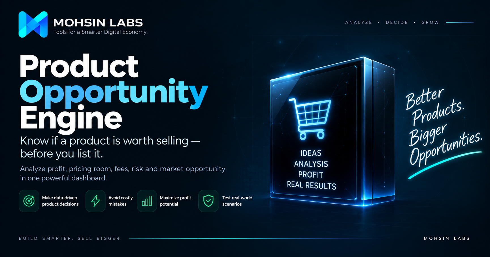

# Product Opportunity Engine

### Mohsin Labs — Product #002

> **Know if a product is worth selling — before you list it.**

A responsive product decision engine that helps sellers evaluate profitability, pricing resilience, marketplace fees, risk exposure, break-even points, and product economics before committing capital.

[Live Demo](https://mohsin-builds.github.io/product-opportunity-engine/)

---



---

## Overview

The **Product Opportunity Engine** is a browser-based decision tool designed to help sellers evaluate the economics of a product before listing or testing it.

Instead of looking only at potential profit, the engine combines:

- unit economics
- profit margin
- ROI
- marketplace fees
- shipping pressure
- break-even pricing
- pricing resilience
- stress testing
- risk exposure
- opportunity scoring

into one interactive decision dashboard.

The goal is not to promise a “winning product.”

The goal is to help sellers make a more informed commercial decision before spending money on inventory, advertising, or marketplace listings.

---

## Live Demo

**Try the application:**

https://mohsin-builds.github.io/product-opportunity-engine/

---

## Core Features

### 1. Product Inputs

Users can enter:

- Marketplace
- Selling Price
- Supplier Cost
- Shipping Cost
- Marketplace Fee
- Payment Fee
- Risk Allowance
- Other Costs

Supported marketplace selections:

- Amazon
- eBay
- Shopify / Direct
- Other

---

### 2. Opportunity Score

The engine produces a score from **0–100** using five weighted categories:

| Category | Weight |
|---|---:|
| Profit Quality | 30 |
| Price Resilience | 20 |
| Fee Efficiency | 20 |
| Logistics | 15 |
| Risk Resilience | 15 |
| **Total** | **100** |

The final score is translated into a commercial verdict:

| Score | Verdict |
|---|---|
| 80–100 | Strong Product to Test |
| 65–79 | Promising Opportunity |
| 50–64 | Needs Caution |
| Below 50 | Weak Opportunity |

A product with negative economics is prevented from receiving an artificially strong verdict.

---

## Profit Economics

The engine calculates the core economics of each product.

### Fixed Costs

```text
Supplier Cost
+ Shipping Cost
+ Risk Allowance
+ Other Costs
